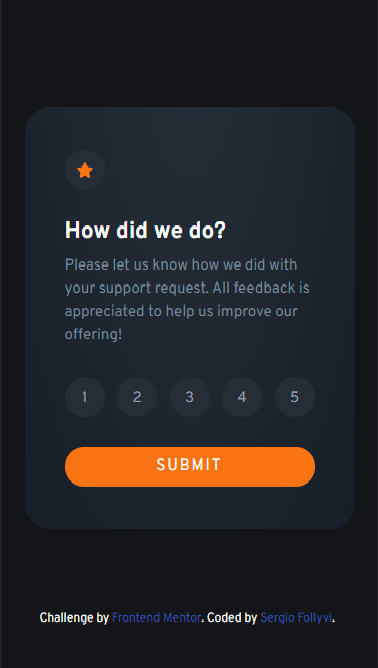

# Frontend Mentor - Interactive rating component solution

This is a solution to the [Interactive rating component challenge on Frontend Mentor](https://www.frontendmentor.io/challenges/interactive-rating-component-koxpeBUmI). Frontend Mentor challenges help you improve your coding skills by building realistic projects.

## Table of contents

- [Overview](#overview)
  - [The challenge](#the-challenge)
  - [Screenshot](#screenshot)
  - [Links](#links)
- [My process](#my-process)
  - [Built with](#built-with)
  - [What I learned](#what-i-learned)
- [Author](#author)

## Overview

### The challenge

Users should be able to:

- View the optimal layout for the app depending on their device's screen size
- See hover states for all interactive elements on the page
- Select and submit a number rating
- See the "Thank you" card state after submitting a rating

### Screenshot

Desktop


Mobile



### Links

- Solution URL: [github](https://github.com/serfoll/interactive-rating-component)
- Live Site URL: [netlify](https://62979d679f342d0009bc41dd--lucky-chaja-8dc153.netlify.app/)

## My process

### Built with

- Semantic HTML5 markup
- CSS custom properties
- Flexbox
- Mobile-first workflow
- [React](https://reactjs.org/) - JS library
- [Styled Components](https://styled-components.com/) - For styles

### What I learned

Learn alot about styling components with Styled Components, the way it generates custom classes along the ones added by the developer. Workarounds for creating specific functions and passing props along with the styling. Creating reusable components
to avoid repeating code.

```js
//fake radio button effect
for (let i = 0; i < btns.length; i++) {
  if (btns[i] !== e.target) {
    //get the current classes
    currClasses = btns[i].className.split(' ');
    //remove current class
    const cIndex = currClasses.indexOf('current');
    //remove current if exists
    if (cIndex !== -1) {
      currClasses.pop();
    }
    //set classes
    btns[i].className = currClasses.join(' ');
  } else {
    btns[i].className += ' current';
  }
}
```

## Author

- Frontend Mentor - [@serfoll](https://www.frontendmentor.io/profile/serfoll)
- Twitter - [@sergio_fol](https://twitter.com/sergio_fol)
